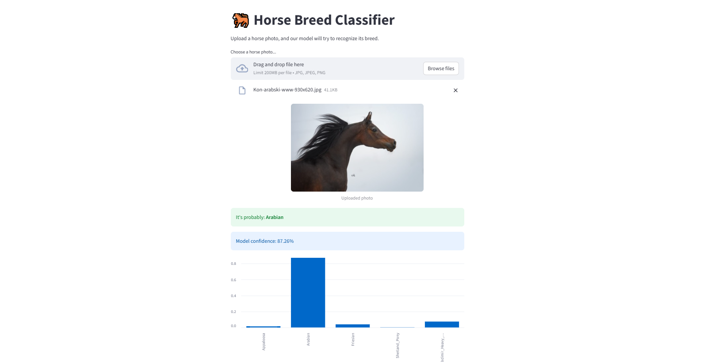
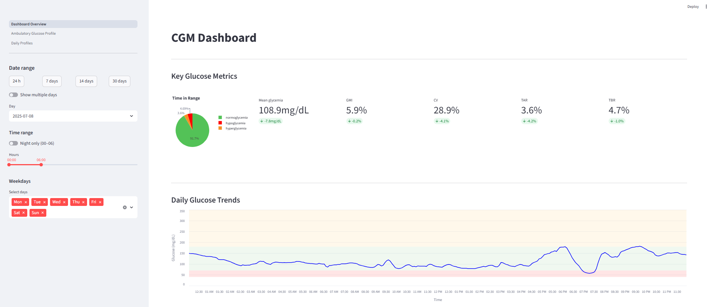
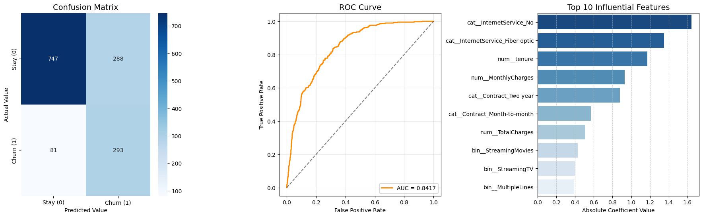
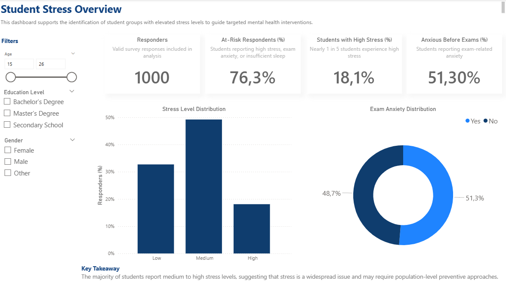

# Hi, I'm Alicja 👋

I’m an analytical student who loves working with structured datasets, reporting tools, and data validation processes.
I enjoy transforming data into clear, structured insights that support business decision-making. Additionally, I am passionate about integrating machine learning and AI into my projects.

## 🚀 Languages & Tools

## 📊 Selected Projects

<table border="0">
  <tr>
    <td width="50%" valign="top">
      
      <h4>Horse Breed Classification</h4>
      
<kbd>Deep Learning</kbd> <kbd>Streamlit</kbd> 
      EfficientNetB0 model with transfer learning and fine-tuning, deployed as an interactive web app.

      <a href="https://github.com/Alicja141004/horse-breed-classification"><b>View Repo →</b></a>
    </td>
    <td width="50%" valign="top">
      
      <h4>Python Data Analysis – CGM</h4>
      
<kbd>EDA</kbd> <kbd>Time Series</kbd> 
      In-depth exploratory analysis of continuous glucose monitoring data, focusing on variability and trends.

      <a href="https://github.com/Alicja141004/CGM-Data-Analysis"><b>View Repo →</b></a>
    </td>
  </tr>
  <tr>
    <td width="50%" valign="top">
      
      <h4>Telco Churn – ML</h4>
      
<kbd>Classification</kbd> <kbd>Feature Engineering</kbd> 
      Predictive model for customer churn, emphasizing data preprocessing and evaluation metrics.

      <a href="https://github.com/Alicja141004/telco-churn-eda-and-ml"><b>View Repo →</b></a>
    </td>
    <td width="50%" valign="top">
      
      <h4>Student Stress Dashboard</h4>
      
<kbd>Power BI</kbd> <kbd>Data Viz</kbd> 
      Interactive operational dashboard identifying at-risk groups and stress correlations.

      <a href="https://github.com/Alicja141004/student-stress-powerbi-dashboard"><b>View Repo →</b></a>
    </td>
  </tr>
</table>

## 📫 Contact
- 💼 LinkedIn: [Alicja Szulc](https://www.linkedin.com/in/alicja-szulc-373250256/)
- 📧 Email: [alicja.szulc.007@email.com](mailto:alicja.szulc.007@email.com)

